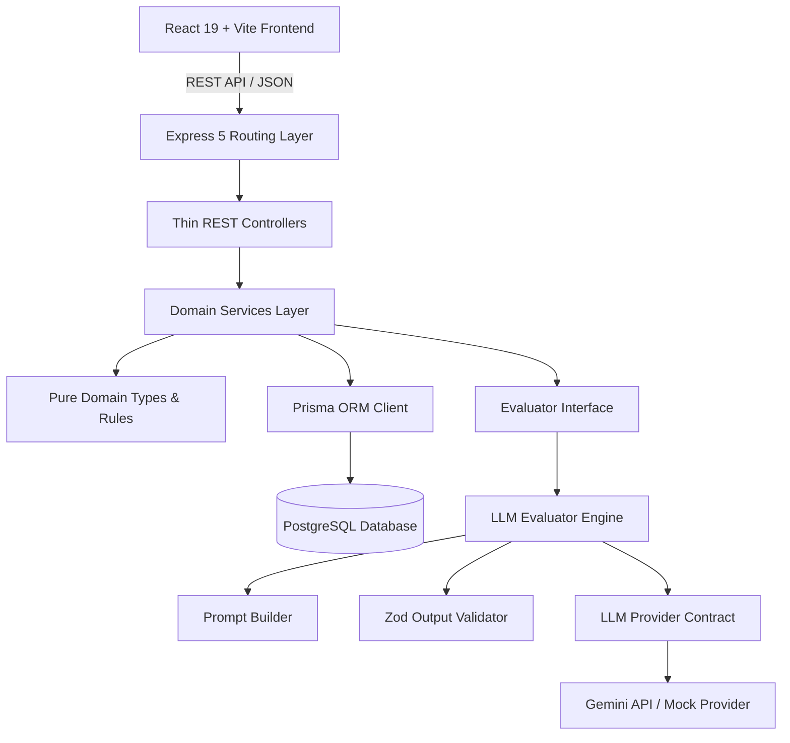
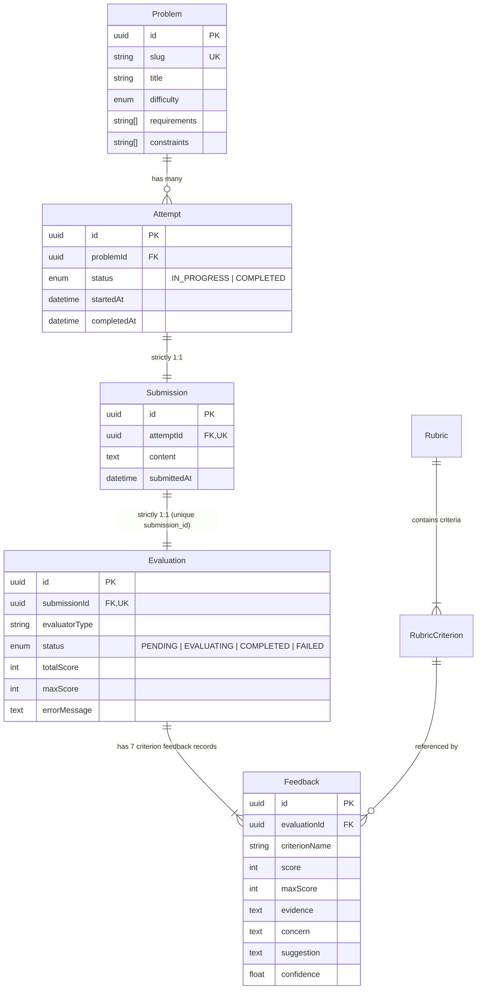
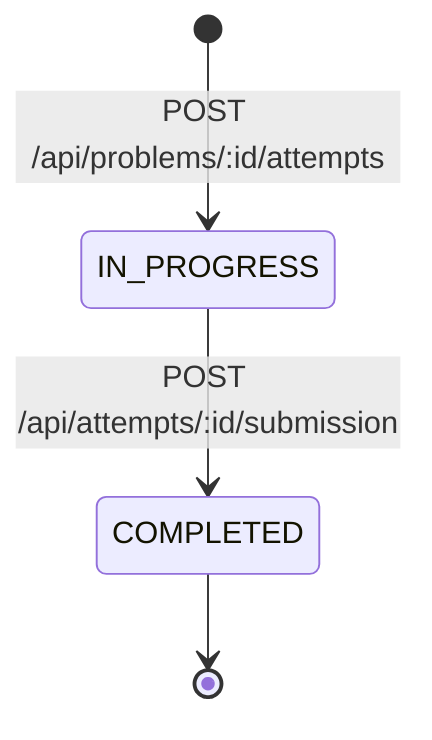
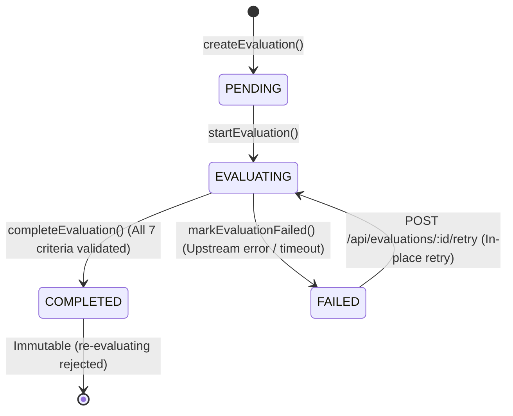

# Low-Level Design (LLD) Practice Platform - System Architecture

This document provides a concise, deep architectural overview of the Low-Level Design Practice Platform.

---

## 1. System Architecture

The platform is structured as a clean, decoupled client-server architecture:



### Architectural Guardrails
1. **Thin Controllers**: Controllers only parse HTTP parameters (`req.params`, `req.body`), validate inputs via Zod, invoke the appropriate Service, and return structured JSON responses.
2. **Framework-Agnostic Domain Logic**: Business rules (e.g. 1:1 Attempt-to-Submission constraints, state transitions, save-before-evaluate guarantee) live strictly within Services and Domain modules.
3. **Provider Agnosticism**: The core platform never depends directly on specific LLM SDKs; all evaluator implementations implement the pure `Evaluator` interface.
4. **No Client DB Access**: The React client communicates strictly through HTTP/JSON REST endpoints.

---

## 2. Request Flow

When a learner submits an LLD solution, the system enforces a strict transactional and state-safe lifecycle:

```mermaid
sequenceDiagram
    autonumber
    actor Learner
    participant React as React Client
    participant SubmissionCtrl as Submission Controller
    participant EvalService as Evaluation Service
    participant Evaluator as LLMEvaluator
    participant DB as PostgreSQL

    Learner->>React: Clicks "Submit Solution"
    React->>SubmissionCtrl: POST /api/attempts/:id/submission
    SubmissionCtrl->>EvalService: createSubmission(attemptId, content)
    EvalService->>DB: INSERT Submission (type=TEXT) & UPDATE Attempt (status=COMPLETED)
    EvalService-->>React: 201 Created { submission }

    React->>SubmissionCtrl: POST /api/submissions/:id/evaluation
    SubmissionCtrl->>EvalService: evaluateSubmission(submissionId)
    EvalService->>DB: INSERT Evaluation (status=EVALUATING) [Save-Before-Evaluate]
    EvalService-->>React: 201 Created { evaluation: { status: "EVALUATING" } }

    rect rgb(20, 24, 33)
    Note over EvalService,Evaluator: Asynchronous / Background Pipeline
    EvalService->>Evaluator: evaluate({ problem, submission, criteria })
    Evaluator->>DB: Fetch Active Rubric Criteria
    Evaluator->>Evaluator: Construct System + User Prompt (Anti-Hallucination)
    Evaluator->>Evaluator: Invoke Provider & Validate Schema with Zod
    Evaluator-->>EvalService: CriterionEvaluationResult[]
    EvalService->>EvalService: Calculate totalScore = SUM(criterion scores)
    EvalService->>DB: Transaction: UPDATE Evaluation (COMPLETED) + INSERT Feedback[]
    end

    loop Every 2.5s Polling
        React->>EvalService: GET /api/evaluations/:id
        EvalService-->>React: { evaluation: { status: "COMPLETED", totalScore, feedback } }
    end
```



---

## 3. Domain Entity Relationships

The relational schema is enforced via PostgreSQL foreign keys and unique constraints:



---

## 4. Evaluation Architecture & Deterministic Scoring

The LLM is **never** permitted to declare the final total score directly. This prevents hallucinated math and maintains strict grading consistency:

$$\text{totalScore} = \sum_{i=1}^{7} \text{score}_i \quad \text{where } 0 \le \text{score}_i \le \text{maxScore}_i$$

$$\sum_{i=1}^{7} \text{maxScore}_i = 100$$

### Validation Pipeline:
1. **JSON Sanitation**: Strips potential markdown code block wrappers (````json ... ````).
2. **Schema Validation**: Validates top-level and item fields via Zod.
3. **Rubric Alignment**:
   - Every `criterionId` in the active database rubric must be evaluated exactly once.
   - Rejects unknown criterion IDs.
   - Rejects missing criterion IDs.
   - Rejects negative scores or scores exceeding criterion `maxScore`.
   - Rejects confidence values outside $[0.0, 1.0]$.
4. **Deterministic Calculation**: The backend sums all validated criterion scores and transactionally commits both the parent `Evaluation` and child `Feedback` records.

---

## 5. State Machine & Lifecycle Transitions

### Attempt State Machine:


### Evaluation State Machine:


---

## 6. Retry Semantics: Learner Retry vs Evaluation Retry

A key architectural distinction is made between two fundamentally different operations:

| Property | Learner Retry ("Try Again") | Evaluation Retry |
|---|---|---|
| **Trigger** | Learner wants to redesign or iterate after seeing feedback | Upstream LLM/network failure during evaluation |
| **API Endpoint** | `POST /api/problems/:problemId/attempts` | `POST /api/evaluations/:evaluationId/retry` |
| **Attempt Record** | **Creates brand new `Attempt`** | Reuses original `Attempt` |
| **Submission Record**| **Creates brand new `Submission`** | Reuses original `Submission` |
| **Evaluation Record**| **Creates brand new `Evaluation`** | **Updates same `Evaluation` in-place** |
| **History Effect** | Preserves Attempt 1 in history table with past score | Resumes `FAILED` $\rightarrow$ `EVALUATING` |

---

## 7. LLM Provider Boundary & Anti-Hallucination

The prompt builder enforces strict evaluation guidelines:
- **Design Evaluation Only**: Evaluates purely technical merits in the submitted text without rewarding unstated assumptions (e.g. if caching is unmentioned, evaluator notes "No caching layer specified").
- **Independent Rubric Scoring**: Scores each criterion solely against its stated rubric description.
- **Evidence-First Feedback**: Mandatory verbatim citation or reference from the candidate's solution for every criterion.
- **Actionable Guidance**: Concerns and suggestions must provide specific architectural alternatives (e.g. Strategy pattern, ReaderWriterLock, thread pool sizing).

---

## 8. Data Integrity & Concurrency

- **1:1 Attempt-to-Submission**: Enforced by database unique constraint `@@unique([attemptId])` on `submissions`.
- **1:1 Submission-to-Evaluation**: Enforced by database unique constraint `@@unique([submissionId])` on `evaluations`.
- **Save-Before-Evaluate Guarantee**: Solutions are committed to PostgreSQL *before* any external model API is contacted. If the model fails, the candidate's work is never lost.
- **Evaluation Immutability**: Completed evaluations cannot be overwritten or transitioned back to evaluating status.
